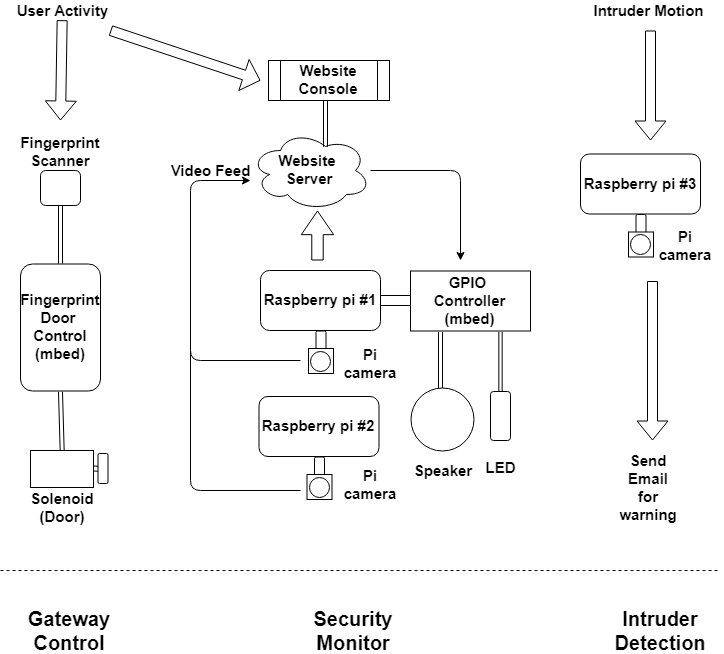

# Raspberry Pi Home Security Control System with User Recognition
# by: Aosen Ba, Runfeng Chen, Chang Qin, Zhixiang Ren

The project is a Raspberry Pi Web controlled home security system. It has three parts which are gateway control, user recognition, and Web GUI control. The first part allows user to unlock the door (represented by solenoid) by verifying his finger prints. User recognition part will send the user a email with snapshot for warning if it detects motion. Web GUI is designed to make user able to get live stream video from multiple Raspberry Pi Cameras, change shooting angles, and even take a picture by clicking a button. If the user finds a invader, he can send different sound alerts to home from the Web GUI.

## Flow Diagram

